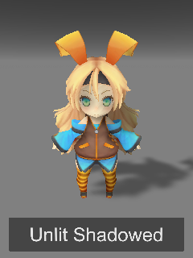

Cubed's Unity Shaders
============

A compilation of custom shaders for Unity3D.

Currently built for Unity 5.3.4p1 due to project constraints, but will be updated to 5.6.x at some point.

## Included Shaders
* Unlit Shadowed  

  * A simple unlit texture shader, has inputs for main color tint and shadow color tint.
* Simple Gradient Sky  

  * A simple procedural skybox that fades from a sky color to a horizon color

## Notes
Project contains the following assets:  
* <a href="http://acegikmo.com/shaderforge/">ShaderForge</a> (gitignored)
* <a href="http://unity-chan.com/">SD UnityChan</a>
* <a href="http://u3d.as/9TS/">Instant Screenshot</a>

## Tip Jar  
<a href="https://digitaltipjar.com/cubedparadox?_external=true" class="dtj-tip-button" data-username="cubedparadox">
  Digital Tip Jar
</a>

 This work is licensed under a <a rel="license" href="http://creativecommons.org/licenses/by/4.0/">Creative Commons Attribution 4.0 International License</a>.
