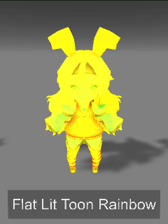
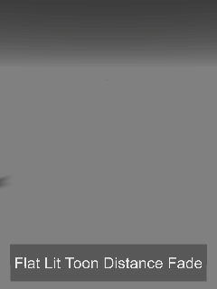

Cubed's Unity Shaders
============

A compilation of custom shaders for Unity3D.  
**If you are upgrading from an older unitypackage, I recommend deleting the old 'Cubeds Unity Shaders' Folder first.**  
**I've deprecated some old shader varients, if you're missing a shader, try switching to the new 'Flat Lit Toon' shader.**  
You can download the latest version of this package to import **here**: [CubedsShaders.unitypackage](https://github.com/cubedparadox/Cubeds-Unity-Shaders/raw/master/Packages/CubedsShaders.unitypackage)  
Currently built for Unity 5.3.4p1 due to project constraints, but will be updated to 5.6.x at some point.

## Shaders
* Flat Lit Toon  
 
  * Looks like a unlit shader under good neutral lighting, but actually responds to full ambient and realtime lighting color, intensity and shadow.
* Flat Lit Toon Rainbow  
* Unlit Shadowed  

  * A simple unlit texture shader, has inputs for main color tint and shadow color tint.

  * An (old) version of 'Flat Lit Toon' with a cycling rainbow color. Hue and Saturation are exposed, Supports color mask.
* Flat Lit Toon Distance Fade  

  * An (old) version of 'Flat Lit Toon' that fades in based on proximity to camera. Uses noise to dither the fade effect into an alpha cutout. Dither amount, color tint, and color mask are exposed.
* Simple Gradient Sky  

  * A simple procedural skybox that fades from a sky color to a horizon color

## Notes
Project contains the following assets:  
* <a href="http://acegikmo.com/shaderforge/">ShaderForge</a> (gitignored)
* <a href="http://unity-chan.com/">SD UnityChan</a>
* <a href="http://saadkhawaja.com/instant-hi-res-screenshot/">Instant Screenshot</a>

### Tip Jar  

 This work is licensed under a <a rel="license" href="http://creativecommons.org/licenses/by/4.0/">Creative Commons Attribution 4.0 International License</a>.
